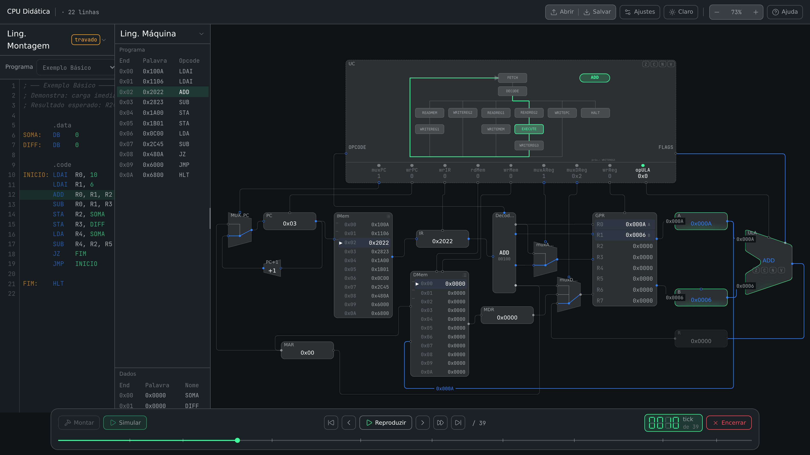
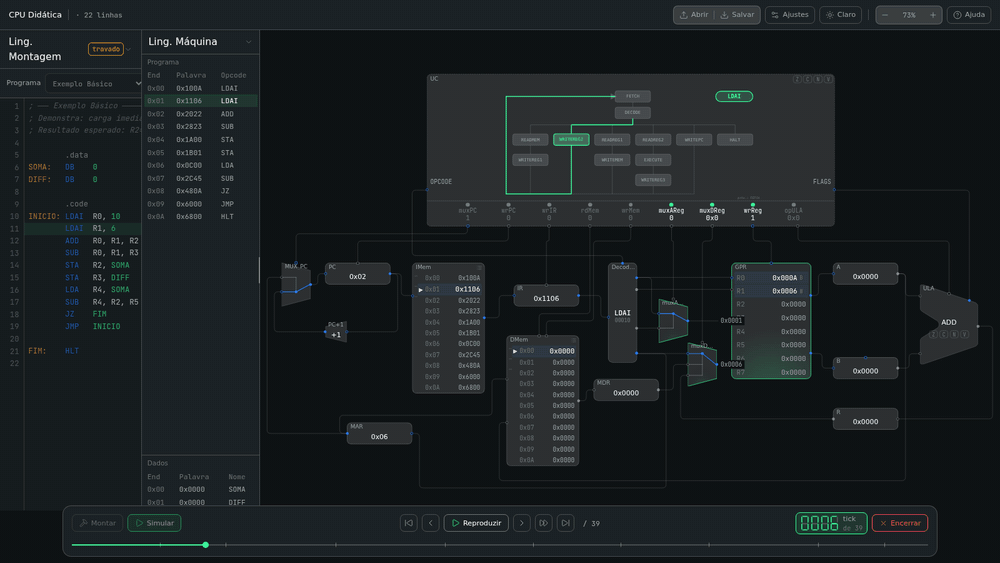

<div align="center">

# CPU Didática

**Escreva um programa em assembly e acompanhe, tick a tick, o caminho de dados que o executa.**

Um simulador visual de CPU, feito para aulas de Arquitetura e Organização de Computadores.

[**Abrir o simulador →**](https://cpu-didatica.vercel.app)

[](LICENSE)
[](https://github.com/richassis/cpu-didatica/actions/workflows/ci.yml)
[](CONTRIBUTING.md)

🇧🇷 Português · [🇬🇧 English](README.en.md)

<picture>
  <source media="(prefers-color-scheme: light)" srcset="docs/images/light.png">
  
</picture>

</div>

---

## Por que existe

Nos livros, o caminho de dados de uma CPU é um diagrama parado. O aluno lê que "no estado
EXECUTE a ULA soma A e B", mas não vê isso acontecer, e é difícil ligar uma linha de assembly
aos sinais de controle, aos registradores e aos fios que ela movimenta.

A CPU Didática faz essa ligação. O aluno escreve o programa, monta e executa, e acompanha cada
tick do relógio: qual estado a unidade de controle está, quais sinais ela liga, que valor passa
por cada fio e onde ele chega. Dá para avançar, voltar e repetir quantas vezes quiser.

Ela roda no navegador e não precisa de instalação nem de conta. Basta mandar o link para a turma.

## O que dá para fazer

<div align="center">
  
</div>

- **Escrever e montar assembly.** O editor tem destaque de sintaxe e erros de montagem com o
  número da linha. Ao lado fica o código de máquina gerado, palavra por palavra, e a linha em
  execução fica destacada nos dois.
- **Assistir a execução.** Cada valor percorre o fio por onde realmente passa, na ordem em que
  o hardware o produz. Um registrador só muda quando o dado chega nele, e as flags só mudam
  quando a ULA calcula.
- **Navegar no tempo.** Há uma linha do tempo com todos os ticks. Dá para reproduzir, pausar,
  voltar, pular para o fim, arrastar até um ponto, e segurar `F` para acelerar a animação.
- **Ver a unidade de controle por dentro.** A máquina de estados aparece como um grafo, com o
  estado atual aceso, e os sinais de controle ficam em uma faixa logo abaixo.
- **Inspecionar as memórias.** A memória de instruções e a de dados ficam roláveis e seguem o
  endereço em uso.
- **Ajustar a visualização.** Os valores podem ser mostrados em hexadecimal, decimal, decimal
  com sinal ou binário. Também há tema claro e escuro, tamanho do texto, velocidade da animação,
  quais fios mostrar e o idioma da interface (português ou inglês).
- **Aprender sem sair da tela.** A ajuda traz um guia, a referência completa da ISA, a descrição
  de cada bloco do caminho de dados e um tour guiado no primeiro acesso.
- **Começar de um exemplo.** Há cinco programas prontos: Exemplo Básico, laço FOR, IF-THEN-ELSE,
  desvios e instruções lógicas. O código pode ser salvo e aberto como `.asm` ou `.txt`.

## A arquitetura

A CPU é multiciclo, de 16 bits, com Harvard separando instruções e dados. Ela tem o tamanho
certo para caber em uma aula e ser lida inteira.

| Bloco | Especificação |
|---|---|
| Memória de instruções | 256 palavras de 16 bits |
| Memória de dados | 256 palavras de 16 bits, com valores iniciais pela diretiva `.data` |
| Banco de registradores | 8 registradores de 16 bits (`R0` a `R7`), duas leituras e uma escrita |
| ULA | ADD, SUB, AND, OR e NOT, com as flags **Z**, **C**, **N** e **V** |
| Unidade de controle | Máquina de estados: busca, decodificação e um caminho por classe de instrução |

### Conjunto de instruções

| Instrução | Efeito | Flags |
|---|---|---|
| `LDA Rd, M` | `Rd ← DMem[M]` | Z, N |
| `LDAI Rd, N` | `Rd ← N` (imediato de 8 bits com sinal) | Z, N |
| `STA Rs, M` | `DMem[M] ← Rs` | — |
| `ADD Ra, Rb, Rd` | `Rd ← Ra + Rb` | Z, C, N, V |
| `SUB Ra, Rb, Rd` | `Rd ← Ra − Rb` | Z, C, N, V |
| `AND Ra, Rb, Rd` | `Rd ← Ra AND Rb` | Z, C, N, V |
| `OR Ra, Rb, Rd` | `Rd ← Ra OR Rb` | Z, C, N, V |
| `NOT Ra, Rd` | `Rd ← NOT Ra` | Z, C, N, V |
| `JZ M` | se Z = 1, `PC ← M` | — |
| `JN M` | se N = 1, `PC ← M` | — |
| `JMP M` | `PC ← M` | — |
| `HLT` | para a execução | — |

### Um programa de exemplo

```asm
        .data
SOMA:   DB    0             ; resultado de R0 + R1
DIFF:   DB    0             ; resultado de R0 - R1

        .code
INICIO: LDAI  R0, 10        ; R0 = 10
        LDAI  R1, 6         ; R1 = 6
        ADD   R0, R1, R2    ; R2 = 16
        SUB   R0, R1, R3    ; R3 = 4
        STA   R2, SOMA      ; mem[SOMA] = 16
        STA   R3, DIFF      ; mem[DIFF] = 4
        LDA   R4, SOMA      ; R4 = 16
        SUB   R4, R2, R5    ; R5 = 0, então Z = 1
        JZ    FIM
        JMP   INICIO
FIM:    HLT
```

## Para professores

- **Não precisa instalar nada.** O simulador é uma página web. Funciona em computador de
  laboratório, notebook do aluno ou projetor.
- **Os programas são arquivos de texto.** Você pode distribuir exercícios como `.asm` e os
  alunos abrem no simulador.
- **Nada sai do navegador.** Não há login nem servidor guardando o que o aluno escreve.
- **Dá para adaptar.** Se a sua disciplina usa outra ISA ou outro caminho de dados, o código é
  aberto e o caminho de dados é um arquivo de layout editável. Veja
  [Rodando localmente](#rodando-localmente).

Usou em aula? Contar como foi ajuda muito o projeto. Use
[Discussions](https://github.com/richassis/cpu-didatica/discussions) ou a aba **Feedback**
na ajuda do simulador.

## Rodando localmente

É preciso ter Node.js 20.9 ou mais recente.

```bash
git clone https://github.com/richassis/cpu-didatica.git
cd cpu-didatica
npm install
npm run dev      # http://localhost:3000
```

### Modo aluno e modo editor

O mesmo app tem dois modos, e uma flag de build decide qual está disponível:

| | `npm run dev` | `npm run build && npm start` |
|---|---|---|
| Modo programa (o que o aluno vê) | sim | sim |
| Modo edição (posicionar blocos, criar fios) | sim | não |

A flag é `NEXT_PUBLIC_ENABLE_EDITOR`, definida em `next.config.ts` e lida só em
`lib/editorFlag.ts`. Para gerar um build de produção com o editor:

```bash
NEXT_PUBLIC_ENABLE_EDITOR=1 npm run build && npm start
```

### O caminho de dados é um arquivo

`public/default-project.cpud` é o layout que todo mundo vê. Ele é lido a cada carga da página,
então um layout novo chega a todos os usuários assim que é publicado. Para alterar:

1. Rode `npm run dev`, entre no modo edição e reposicione o que precisar.
2. As mudanças são gravadas no arquivo pela rota `app/api/default-project/route.ts`, que só
   existe com o editor ligado. O botão **Salvar no arquivo** força a gravação.
3. Faça o commit do `.cpud`.

### Estrutura

```
app/             página única e a rota de gravação do layout (só em desenvolvimento)
components/      canvas, blocos, janelas; ProgramMode/ é a interface do aluno
lib/             stores (Zustand), montador, desmontador, animação
lib/i18n/        os textos da interface, em português (pt/) e inglês (en/)
lib/simulator/   o domínio: CPU, ULA, memórias, registradores, barramentos — sem React
public/          default-project.cpud, o caminho de dados de referência
```

Feito com [Next.js](https://nextjs.org), React, TypeScript, [Zustand](https://zustand.docs.pmnd.rs)
e Tailwind CSS.

## Como contribuir

Contribuições de todo tipo são bem-vindas: relatar um bug, sugerir uma instrução nova, melhorar
um texto da ajuda, escrever um programa de exemplo ou mandar código.

- Encontrou um problema? [Abra uma issue](https://github.com/richassis/cpu-didatica/issues/new/choose).
- Tem uma ideia ou uma dúvida? Use as [Discussions](https://github.com/richassis/cpu-didatica/discussions).
- Quer programar? Leia o [guia de contribuição](CONTRIBUTING.md) e procure as issues marcadas
  com [`good first issue`](https://github.com/richassis/cpu-didatica/labels/good%20first%20issue).

Quem participa do projeto segue o [código de conduta](CODE_OF_CONDUCT.md).

## Créditos

Projeto do **C3, o Centro de Ciências Computacionais** da
**Universidade Federal do Rio Grande (FURG)**.

- **Professor:** Ewerson Carvalho
- **Desenvolvimento:** Richard de Assis

## Licença

[MIT](LICENSE). Você pode usar, modificar e redistribuir, inclusive em outras disciplinas e
instituições, desde que mantenha o aviso de autoria.
